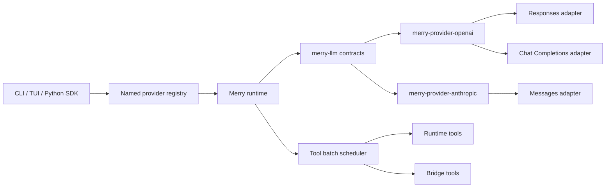

# Multi-Provider Runtime Product Reset

**Status:** Approved design

**Date:** 2026-07-10

**Delivery focus:** Make Merry a usable Rust-first agent runtime with real
streaming, OpenAI Chat Completions, Anthropic Messages, multi-tool turns, and a
focused terminal interface.

This specification supersedes the active product and UI direction recorded in
`specs/2026-06-16-tui-ui-design.md`. Earlier specifications remain historical
evidence for already implemented contracts. `README.md` and `ROADMAP.md` will
be rewritten from scratch as part of this delivery; Git history is the archive
for their old contents.

## 1. Current Gaps

The existing implementation has useful runtime foundations, but the product is
not yet practical as a general model runtime.

1. `RetryingModelProvider` collects a complete successful attempt into a
   `Vec<ModelEvent>` before returning it. With retry enabled, callers receive a
   buffered replay rather than live provider deltas.
2. `merry-provider-openai` implements the Responses protocol only. Many hosted
   and self-hosted OpenAI-compatible services expose Chat Completions instead.
3. There is no Anthropic Messages provider.
4. Provider configuration assumes one fixed OpenAI-compatible provider shape,
   which prevents model roles from selecting providers with different wire
   protocols.
5. Provider parsers can observe more than one tool call, but runtime model
   output handling, the agent loop, the interactive loop, and continuation
   validation reject or block multiple pending calls.
6. CLI generation configuration sends `reasoning_effort = "medium"` when the
   user did not request it, overriding provider and model defaults.
7. The TUI repeats task, status, queue, artifact, and activity information
   across permanent `CHAT`, `FOCUS`, and `RUN` panels. This reduces usable space
   without improving control.
8. The default interactive launch requires users to understand an internal
   sandbox handoff flag, and resume-safe persistence is not consistently tied
   to every stable runtime boundary.
9. `README.md` and `ROADMAP.md` describe an older product state and no longer
   provide a reliable entry point or active delivery sequence.

## 2. Goals

- Preserve provider-neutral runtime, context, memory, artifact, and ledger
  contracts.
- Deliver real end-to-end streaming through retry, runtime, CLI, Python, and
  TUI layers.
- Support OpenAI Responses and Chat Completions from one OpenAI provider crate.
- Support the standard Anthropic Messages API with a configurable base URL.
- Accept multiple tool calls in one model turn and return one complete batch of
  corresponding results.
- Execute calls concurrently only when the registered tool explicitly declares
  that overlapping execution is safe.
- Allow named providers and per-role model/provider selection in configuration.
- Make provider and generation defaults capability-aware without silently
  forcing optional features.
- Replace the permanent three-panel TUI with one chronological work surface and
  on-demand detail views.
- Keep cancellation, durability, evidence, and permission boundaries at least
  as strict as the existing runtime.

## 3. Non-Goals

- A universal provider abstraction over every vendor-specific extension.
- OpenAI Assistants, Realtime, or provider-hosted conversation state.
- Anthropic vendor forks or service-specific request branches.
- Automatic semantic analysis of shell command arguments to infer concurrency
  safety or data dependencies.
- Unbounded tool execution concurrency.
- Concurrent execution of tools that have not opted into a parallel-safe
  contract.
- A graphical or web UI.
- Live-provider tests in the default test suite or CI.
- Preserving the old TOML provider structure through a second legacy parser.

## 4. Architecture



Ownership remains explicit:

- `merry-core` owns `ToolCallBatchId`, durable pending-batch shapes, and journal
  event contracts.
- `merry-llm` owns model requests, normalized events, provider traits, usage,
  finish reasons, retry policy, `ModelToolCallBatch`, and model-facing batch
  continuation types.
- `merry-provider-openai` owns private Responses and Chat Completions wire
  structs, rendering, SSE parsing, authentication, and HTTP errors.
- `merry-provider-anthropic` owns private Messages wire structs, rendering, SSE
  parsing, authentication, and HTTP errors.
- `merry-runtime` owns durable pending-call batches, scheduling, execution,
  artifacts, results, cancellation, continuation compilation, and checkpoints.
- `merry-cli` owns TOML parsing, provider construction, model-role resolution,
  sandbox startup, and terminal presentation.
- `merry` and `merry-py` expose typed construction APIs without reimplementing
  provider or runtime behavior.

Provider-specific response structures must not appear in runtime, memory,
artifact, skill, compiler, or SDK event types.

## 5. Real Streaming And Retry

### 5.1 Observable stream contract

`ModelProvider::stream_model` remains the primary provider boundary. Calling it
returns a stream without first consuming the provider response. The outer retry
stream emits exactly one observable `ModelEvent::Started`.

The following events commit observable model output:

- `ModelEvent::OutputTextDelta`
- `ModelEvent::ToolCallRequested`
- `ModelEvent::Completed`

Provider-attempt `Started` events are internal to the retry state machine and
are not forwarded individually.

### 5.2 Retry boundary

- Setup failures and retryable stream failures may start a new attempt only
  before the first committed output event.
- After any committed output event, a stream error is forwarded immediately and
  the attempt is never replayed.
- Authentication, invalid request, protocol, and cancellation errors are never
  retried.
- Rate-limited and unavailable errors retain bounded exponential backoff and
  jitter under the configured retry policy.
- Backoff waits and active attempts select on the cancellation token.
- Dropping the returned stream stops the active producer and prevents another
  attempt from starting.

This boundary prevents duplicate text and duplicate tool calls while retaining
useful retries for failures that occurred before the user observed output.

### 5.3 UI propagation

Runtime, CLI, Python async iteration, and TUI projection forward deltas as they
arrive. The TUI appends each delta to the active assistant timeline item. It
does not wait for `Completed` to construct the visible response.

## 6. Multi-Tool Turns

### 6.1 Provider-neutral batch

A model turn may produce one or more `ModelToolCall` values. `merry-llm` groups
them as an ordered, non-empty `ModelToolCallBatch`. Runtime converts that value
into a `PendingToolCallBatch` carrying a runtime-owned `ToolCallBatchId`. Call
IDs must be unique within the batch and session.

The pending batch and its journal entries are appended atomically while holding
the session mutation boundary. Only after that runtime-owned state change
succeeds may Merry publish individual pending-call events. The active session
journal may contain a pending batch, but such a state is deliberately not a
resume-safe disk savepoint. A cancellation or mutation failure cannot expose
half of a batch as accepted, and disk persistence waits until every member has
been resolved.

Continuation validation accepts this shape:

1. one or more ordered tool calls from one assistant turn;
2. exactly one result for every call ID;
3. no unknown, duplicate, or missing result IDs;
4. results rendered back to the provider in original call order.

`ModelToolBatchContinuation` validates and carries the calls and results.
Single-call `ModelToolContinuation` remains a convenience form that converts to
a one-item batch.

### 6.2 Concurrency contract

Every registered tool declares one of these execution contracts:

```rust
pub enum ToolConcurrency {
    ParallelSafe,
    Exclusive,
}
```

`Exclusive` is the default for existing and third-party tools. Built-in tools
opt into `ParallelSafe` only when their executor implementation guarantees that
overlapping calls are safe. This contract is independent of provider protocol
and does not inspect shell text.

The scheduler processes calls in model order:

- consecutive `ParallelSafe` calls form a wave and run with bounded
  concurrency;
- an `Exclusive` call is a barrier and runs only after the previous wave has
  completed;
- the next wave starts only after that exclusive call completes.

The default maximum parallel wave width is four and is configurable. The bound
limits resource pressure; it does not limit how many calls the model may return
in one batch.

### 6.3 Results, failures, and cancellation

- A domain failure resolves only its own call with a failed tool result. Sibling
  calls continue.
- Infrastructure failure is converted into an actionable failed result when a
  durable result can safely be recorded. Errors that make runtime state
  uncertain fail the batch and stop continuation.
- Completion order never changes provider-visible result order.
- Cancellation stops every in-flight executor and prevents queued waves from
  starting. Every unresolved call receives a durable failed tool result with
  diagnostic code `tool_execution_cancelled` before a resume-safe savepoint is
  written. No new provider-visible result status is introduced.
- Bridge tools may have multiple outstanding calls. SDK results are matched by
  call ID and may arrive out of order.
- A final-output tool must be the only call in its batch. A mixed final-output
  batch is a protocol error.

### 6.4 Capability mode

Generation configuration exposes `parallel_tool_calls = "auto" | "enabled" |
"disabled"`. `auto` is the default and enables multiple calls when the selected
provider advertises support. `enabled` fails early if the provider declares the
capability unsupported. `disabled` renders the protocol-specific opt-out.

## 7. OpenAI Provider

### 7.1 Public configuration

`merry-provider-openai` adds:

```rust
pub enum OpenAiProtocol {
    Responses,
    ChatCompletions,
}
```

`OpenAiProviderConfig` selects the protocol. The default remains `Responses`
for direct Rust construction. CLI TOML requires an explicit protocol so a
custom OpenAI-compatible endpoint is never guessed.

### 7.2 Internal modules

The crate is split by responsibility:

- shared client, headers, endpoint construction, SSE framing, cancellation,
  request IDs, and sanitized HTTP errors;
- `responses` private wire, render, and parse modules;
- `chat_completions` private wire, render, and parse modules.

### 7.3 Chat Completions mapping

- Endpoint: `{base_url}/chat/completions`.
- Merry system messages render with the `system` role for broad compatible-host
  support.
- One Merry tool batch renders as one assistant message containing ordered
  `tool_calls`, followed by one `tool` message per result.
- Tools use `type = "function"`, function name, description, and JSON Schema.
- Structured output renders through `response_format`.
- Output limits use `max_completion_tokens`.
- Usage is requested with `stream_options.include_usage = true`.
- Streaming text comes from choice delta content.
- Tool call name, ID, and arguments are buffered by choice/tool index. A
  `ToolCallRequested` event is emitted only after one complete argument object
  is available.
- Multiple choices are not requested. Receiving unsupported extra choices is a
  protocol error rather than silently selecting one.
- `[DONE]` terminates framing but does not replace a required finish chunk.
- `content_filter` maps to provider-neutral `FinishReason::Blocked`.

Responses behavior remains compatible with existing tests while gaining real
streaming retry and multi-tool support.

## 8. Anthropic Provider

### 8.1 Crate and endpoint

A new `merry-provider-anthropic` crate implements `ModelProvider` directly with
`reqwest`. It targets `{base_url}/v1/messages`, defaults to
`https://api.anthropic.com`, and sends:

- `x-api-key`
- `anthropic-version`, defaulting to `2023-06-01`
- `content-type: application/json`

The base URL and version are configurable for standard-compatible hosts. The
adapter contains no vendor-name branches.

### 8.2 Request mapping

- Merry system messages render as top-level Anthropic system text blocks.
- User and assistant messages render as ordered Messages API content blocks.
- A tool batch renders as assistant `tool_use` blocks.
- Results render as user `tool_result` blocks, ordered by the original calls.
- Tool schemas use `input_schema`.
- Parallel calls remain enabled unless effective generation configuration is
  disabled, in which case Anthropic tool choice uses
  `disable_parallel_tool_use = true`.
- `max_tokens` uses the request limit when present and otherwise the provider's
  `default_max_output_tokens`, which defaults to 4096.
- Explicit reasoning effort maps to `output_config.effort`.
- Structured JSON output maps to `output_config.format`.
- Optional fields are omitted when the user did not request them.

### 8.3 Streaming mapping

The parser handles `message_start`, `content_block_start`,
`content_block_delta`, `content_block_stop`, `message_delta`, `message_stop`,
`ping`, and in-stream `error` events.

- `text_delta` produces `OutputTextDelta` immediately.
- `input_json_delta.partial_json` is accumulated per content block and parsed
  only when that block completes.
- Completed client `tool_use` blocks produce ordered `ToolCallRequested`
  events.
- Cumulative usage is normalized without double counting.
- `end_turn` maps to `Stop`, `max_tokens` to `Length`, `tool_use` to
  `ToolCalls`, and `refusal` to `Blocked`.
- Ping, blank frames, and unknown metadata events are ignored for forward
  compatibility.
- Known output content that Merry cannot represent fails with a protocol error;
  it is not silently discarded.

## 9. Errors And Sensitive Data

Both HTTP providers normalize status classes:

- authentication: 401 and 403;
- rate limited: 429;
- unavailable: 5xx, including Anthropic 529;
- invalid request: other 4xx request failures;
- protocol: malformed successful responses, invalid SSE, or unsupported output;
- cancelled: cooperative request or stream cancellation.

Provider errors expose only provider name, normalized kind, HTTP status, a
bounded error type/code, and request ID. Raw HTTP bodies and headers never enter
`ModelError`, tracing fields, the journal, CLI output, or TUI state.

`FinishReason::Blocked` is a normal provider completion reason with no assistant
success output. Runtime projects it as a stable blocked diagnostic rather than
as `StepCompleted`.

## 10. Configuration

The old fixed OpenAI-compatible table is replaced by a tagged registry:

```toml
[providers.default]
provider = "primary"
model = "gpt-4.1-mini"

[providers.primary]
type = "openai"
protocol = "chat_completions"
base_url = "https://api.openai.com/v1"
api_key_env = "OPENAI_API_KEY"

[providers.claude]
type = "anthropic"
base_url = "https://api.anthropic.com"
api_key_env = "ANTHROPIC_API_KEY"
anthropic_version = "2023-06-01"
default_max_output_tokens = 4096

[models.context_compaction]
provider = "claude"
model = "claude-sonnet-example"
```

### 10.1 Provider entries

`type = "openai"` supports `responses` and `chat_completions`.
`type = "anthropic"` supports `messages`, which is implicit for the initial
Anthropic adapter.

Every provider selects exactly one credential source:

- `api_key`
- `api_key_file`, resolved relative to the config file
- `api_key_env`, naming an environment variable

Provider entries may override declared capabilities for compatible hosts whose
feature set differs from the standard protocol. Overrides are explicit booleans
and cannot claim a protocol field that the Merry adapter does not implement.

### 10.2 Model bindings

`providers.default` selects the primary provider alias and model. Tables under
`models` may override either value for context compaction, approval review, and
other runtime roles. Unknown aliases fail during startup with the exact TOML
path.

Model generation fields such as reasoning effort and output limit belong to a
model binding, not to provider transport configuration. Unset optional fields
remain unset. In particular, CLI no longer supplies a default reasoning effort.

### 10.3 Migration policy

There is no dual parser for the old provider layout. `examples/config.toml` and
README include the new schema and a direct old-to-new example. Configuration
tests parse the tracked example to prevent drift.

## 11. Rust And Python SDKs

- The Rust facade exposes OpenAI construction with a protocol selection and a
  separate Anthropic provider builder.
- PyO3 wrappers remain thin and construct the same Rust providers.
- Python adds `OpenAIProvider`, `AnthropicProvider`, and a provider union in
  `RuntimeConfig`.
- `OpenAICompatibleProvider` remains a compatibility alias for
  `OpenAIProvider(protocol="responses")` during the current 0.1 series.
- `Runtime.from_env()` accepts `MERRY_PROVIDER=openai|anthropic`, defaults to
  OpenAI, and reads provider-specific key, base URL, protocol, and version
  variables.
- Python event iteration remains streaming-first and adds no Python-side
  buffering or provider protocol logic.

## 12. Terminal Interface

### 12.1 Visual direction

The interface is a modern, restrained, industrial terminal surface. Merry's
signature magenta/pink remains the memorable identity color, but it is not used
for every hierarchy level.

Default semantic palette:

- magenta/pink: brand, active focus, and live generation;
- charcoal and soft white: primary surface and text;
- cyan: tools, links, and informational state;
- green: success;
- amber: warning, permission, and waiting;
- red: failure only;
- neutral gray: timestamps and secondary metadata.

### 12.2 Layout

- The default view is one chronological conversation/work timeline.
- User input, streaming assistant output, tool calls, tool results, patches,
  permission requests, and artifacts appear in event order.
- Successful routine tool calls collapse to one compact row. Failures,
  permissions, and patches expose the relevant detail by default.
- There is no permanent `FOCUS` or `RUN` panel.
- Selecting an artifact or event opens detail on demand. Wide terminals show a
  right-side detail pane; medium and narrow terminals use a full-screen detail
  view.
- The header is one line containing project, model, session, and run state.
- The footer contains the input editor and one status line for phase, elapsed
  time, usage, non-empty queues, and errors.
- Empty queues and absent selections consume no layout space.

### 12.3 Interaction

- `Enter` submits the active input; `Ctrl+J` inserts a newline.
- `Esc` interrupts active work. When idle, it closes detail/review state before
  affecting input.
- `PageUp` enters timeline review and scrolls older content; `PageDown` moves
  toward the live tail; reaching the tail restores follow mode.
- In review mode, selection follows visible timeline items and `Enter` opens
  detail for selectable artifacts, patches, or tool results.
- Existing next/backlog submission and suspended-task actions remain available,
  but their counters render only when non-empty.
- Session selection remains a separate startup screen for `merry resume`.
- Interaction state is explicit; input history navigation cannot accidentally
  change timeline selection.

The renderer updates on runtime events and input events. It uses a low-frequency
timer only while elapsed time or a spinner is visible, replacing the existing
unconditional 33 ms redraw.

### 12.4 Responsive acceptance

Ratatui `TestBackend` coverage uses at least these viewports:

- 50 x 20: narrow timeline and full-screen detail;
- 80 x 24: standard single timeline;
- 140 x 40: timeline plus on-demand detail.

Long project paths, provider/model names, tool names, and unbroken content must
wrap or truncate deliberately without overlapping adjacent UI.

## 13. Session And Sandbox Lifecycle

- `merry`, `merry run`, and `merry resume` automatically perform the supported
  sandbox handoff. Normal users do not need `--with-sandbox`.
- Missing sandbox prerequisites produce an actionable startup error before the
  terminal enters raw mode.
- A new or resumed interactive runtime attaches its session store during
  construction.
- Resume-safe savepoints are written after stable model completion, complete
  tool-batch resolution, interruption cleanup, and clean exit.
- Pending calls are never serialized as a resumable state. Cancellation first
  records failed results with `tool_execution_cancelled` for every unresolved
  batch member.
- Session picker metadata uses stored projections and does not reconstruct
  provider state from raw chat history.

## 14. Documentation Reset

`README.md` is rewritten as a concise user entry point:

1. what Merry is;
2. build and install;
3. minimum OpenAI Chat and Anthropic configurations;
4. interactive, run, resume, and Python usage;
5. provider capability matrix;
6. safety and sandbox behavior;
7. verification commands and current limitations.

`ROADMAP.md` is rewritten as a controlled active plan. It contains the current
goal, ordered milestones, acceptance evidence, and known blockers. It does not
retain the previous historical status narrative.

The new roadmap priority order is authorized by the user's 2026-07-10 request
to replace the stale roadmap and README and implement real streaming,
OpenAI Chat Completions, Anthropic, multi-tool calls, and a redesigned TUI.

## 15. Test Strategy

### 15.1 Deterministic unit and integration tests

- Retry stream returns before the producer finishes.
- First delta is observable before completion.
- Pre-output retry succeeds without duplicate `Started`.
- Post-output failure is not retried.
- Dropping or cancelling a stream stops attempts and backoff.
- Multi-tool batches are atomically recorded.
- Parallel-safe waves respect the configured bound.
- Exclusive calls create ordering barriers.
- Results preserve model call order despite out-of-order completion.
- One tool failure does not cancel siblings.
- Cancellation durably resolves all pending calls.
- Bridge results may arrive out of order.
- OpenAI Responses, Chat Completions, and Anthropic render and parse text,
  usage, structured output, multiple tools, blocked output, malformed SSE, and
  sanitized errors through local mock servers.
- Config parses the tracked example and rejects ambiguous credentials,
  unsupported protocol combinations, unknown aliases, and capability conflicts.
- Python async iteration observes live deltas without buffering.
- TUI snapshots cover all responsive sizes and interaction modes.

### 15.2 Required verification

```bash
cargo fmt --all --check
cargo clippy --all-targets --all-features -- -D warnings
cargo test --all
cd sdks/python && uv run --with pytest python -m pytest tests -q
git diff --check
```

Live OpenAI and Anthropic smoke tests are opt-in and require explicit
environment variables. They are not required for default CI or local
completion claims.

## 16. Delivery Slices

The design is implemented as independently testable vertical slices:

1. real retry streaming and cancellation;
2. provider-neutral tool batches and scheduler;
3. OpenAI Chat Completions;
4. Anthropic Messages;
5. provider registry, role resolution, Rust/Python SDK migration;
6. TUI, session lifecycle, and automatic sandbox startup;
7. README, roadmap, examples, CI, and full verification.

Every slice must pass its focused tests before the next slice begins. Existing
uncommitted session-resume changes are preserved and extended rather than
reverted.

## 17. Protocol References

- OpenAI Chat Completions API:
  <https://developers.openai.com/api/reference/resources/chat/subresources/completions/methods/create>
- OpenAI Responses migration guide:
  <https://developers.openai.com/api/docs/guides/migrate-to-responses>
- Anthropic Messages API:
  <https://platform.claude.com/docs/en/api/messages>
- Anthropic streaming Messages:
  <https://platform.claude.com/docs/en/build-with-claude/streaming>
- Anthropic tool use:
  <https://platform.claude.com/docs/en/agents-and-tools/tool-use/overview>
